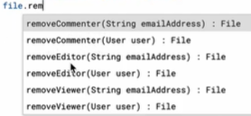

# Introduction

To authorize your script to access your Drive, simply run a script with the DriveApp class:

  

---

# Iterators

While Arrays can be accessed completely and are allocated in their entirety, iterators are consumed one by one on demand i.e. only as necessary. This enables us to store a large collection of items. So we don't get all files in Google Drive at once, and instead of getting all files in an Array we get the files in an Iterable, and we use an Iterator to iterate through that.

To access a folder in our Drive:

  

Note: The return type of the `getFolders()` method is a FolderIterator. So indexing will not work on the returned value.

So to access the next folder in the sequence, we use `.next()` method, which returns a Folder, the properties of which can then be accessed

  

Output:

  

Iterators store states, so if we call this function again, it will give us the next folder

  

Output:

  

If we call the `.next()` function more times than the number of existent folders, it will throw an error.

To resolve this, we need to check whether there is another folder to be accessed or have we reached the end.

  

The output will be same as before.

In case we wish to terminate the iterations for now and want to continue them later, we can use a continuation token.

  

---

# Folders

To access the Root folder of Google Drive (and print its name):

  

Output:

  

But whenever we use `DriveApp` class, we start out from the root folder by default.

To get folders inside the Root folder (or any folder), we have 3 methods:

  

Notice where an iterator is being returned vs when a Folder is being returned.

Usage:

  

---

To create a folder called "Users" and to create a folder inside "Users" called "Profile Data", do the following:

  

Note: `createFolder` returns the folder that was just created, so to create another folder in this new folder, we can chain the two `createFolder` methods.

We can get all folders inside our Drive which have the same name (say "Example"), and then changing their name to something else as follows:

---

# Drive Access & Permissions

When we create a file, say a Google Sheets spreadsheet, it is private (only accessible by us) by default.

If a different account had the URL of our spreadsheet and tried to access it, they would see a message similar to the one below:

  

To grant access to a user via code, we have the following methods based on different access levels:

  

E.g.: Giving Editor access to an ID

Even here, there are multiple ways of doing so

  

Using Email ID as a string, using User class as a parameter, or adding multiple users as the same time:

E.g.:
  

To get the list of Editors (or Viewers/Commenters w/ their respective functions) as an Array of Users:

  

The User class has the following methods:

  

To make the file un-shareable by other Editors (i.e. they can give access of the document to other people):

  

Similar to giving access to people, we can revoke it too:

  

To change general file access:

  

Similarly, for permissions:

  

So if someone wishes to enable everyone with the link to view the document:

  

