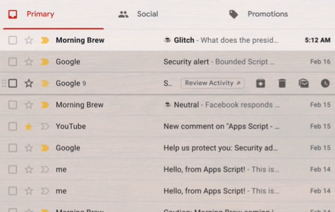
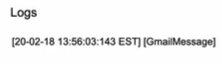

# Introduction

To give the script access to your emails:

  

___

# Automatically Send Emails Using Code

The parent class is `GmailApp`

To send an email:

  

E.g.:

  

For multiple recepients:

  

Some available parameters for the optional arguments are:

  

Usage:

  

Note: The `name` key will change the displayed name of the sender

___

# Get Threads

What are threads?

Each row in the below image is a thread, consisting of more or more mails:

  

A thread with multiple mails is as follows:

  

---

  

Each function from lines 3 to 8 returns a Gmail thread in the form of an array

Output:

  

There are optional parameters that we can work with to get a sub-section of emails. If we wish to get first 2 mails:

  

---

# Getting Data From Emails

To get messages from the first thread from our inbox:

  

Output:

  

To get the details of the first mail of the 3rd (latest) thread:

  

Output:

  

---

# Scanning Your Inbox

To search for mails containing the keyword "YouTube" (similar to how we use the search functionality on Gmail)

  

Output:

This will get mails containing "YouTube" anywhere in the mail, including the attachments. So it is very generalized.

To implement more advanced search functionalities as follows:

  

Do the following:

  

Output:

  

---

To get a sub-section of the mails:

  

This will get the first mail sent by Youtube. 

  

Similarly, to get the first 2 mails, we can put `("from Youtube", 0, 2)` instead.

---

# Automatically Reply To & Forward Emails

There are 2 ways to reply to a mail:
1. Reply to the thread itself (i.e. replying to the last message)
2. Reply to a specific mail in the thread

The following snippet will reply to the 2nd thread from a certain specified person:

  

Note: This will only reply to the sender, and not everyone in the thread.

To reply to everyone in the thread (just like the "Reply All") option, do the following:

  

---

Forwarding mails:

Say we wish to forward the last mail of the 2nd thread from a certain sender, we will do the following:

___

# Acknowledging Emails

Objective: Perform operations such as marking the mails as Read, Unread, Important, Unimportant, and starring them or un-starring them.

In the following snippet, all the mails from the last 24 hours will be marked as Unread:

  

To mark them as read, simply change the method that is used:

  

Similarly to mark Important or Unimportant:

  

  

To Star and Un-Star, we will have to target individual messages.

To star the first message of each thread in the last 24 hours:

  

Same format for Un-Starring:

  

