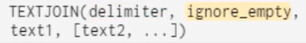
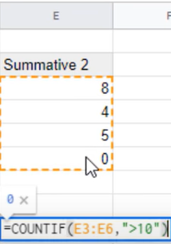
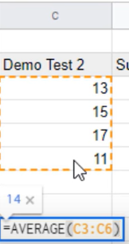
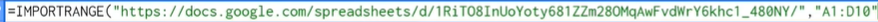
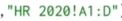

# Important Formulas

## 1.  SUM()

Allows us to add values in a range

  

---

## 2. SUMIF(), SUMIFS()

Add values in a range based on criteria

  

Add the numbers in the given range if they are greater than 10

  

---

Observe the following data:

  

For this data, we want a visit summary as follows:

  

We use SUMIFS() for this as we are dealing with more than one conditions:

  

`sum_range` : The values which we wish to add based on conditions.

`criterion_range1` : The range that the first condition will be tested on.

`criterion1` : The value on which `criterion_range1` will be tested.

  

---

## 3. CONCATENATE(), JOIN(), TEXTJOIN()

These are used to join strings/text together.

  

---

In Join(), we specify the delimiter first, which will be used to separate each cell's string in the specified range.

  

So the formula    will produce the result:

  

---

Textjoin(), like Join() takes the delimiter first, but we also have to specify whether we would like to skip empty cells or not.

  

  

---

## 4. COUNT()

To check the number of numeric values in a range. E.g. in a column, we can use COUNT() to check how many numeric values have been entered.

  

Output is 4

  

Output is 0 as the values are not numeric

---

## 5. COUNTA()

Count All.

It will consider all values, not just numeric when returning the final count.

  

---

## 6. COUNTIF()

Count the values in the given range if they fit the criteria.

  

E.g. use case: To see how many students have scored above a threshold.

---

Similar to SUMIFS(), COUNTIFS() is used to count cells based on multiple conditions/criteria.

  

For the following data:

  

Objective : To find out the number of employees with an MBA specialization in finance, and have completed at least five projects.

Name the ranges for convenience:

  

  

Output: `2`

---

## 7. AVERAGE()

Gives the average of the numeric values in the given range

  

---

## 8. TODAY()

Gives today's date.

  

---

## 9. DATE()

It is advisable to use the DATE() function to manage dates

  

---

In F9 and F12 we have the dates for a new test and an old test defined using TODAY() and DATE() functions respectively:

  

To get the difference between the two dates:

  

---

## 10. VLOOKUP()

It stands for Vertical Lookup.

It searches for a value in the first column of the range.

  

`search_key` is the value that we wish to look for (in the first column)

`index` is the column in our range, the value of which is to be retrieved (1-indexed).

  

---

## 11. SPARKLINE()

Gives a mini-chart linked to the cells

  

Output (for each row):

  

---

## 12. GOOGLETRANSLATE()

Take a string value from a specified cell, translates it, returns the value.

Languages can be specified using language codes.

  

Output:
  

Like other formulas, this can be dragged and adjusted to other cells to maintain uniformity in the same row/column.

---

## 13. CHAR()

Used to get unicode characters.

E.g.: To get a bullet point - 

  

---

  

Output:

  

---

## 14. UNIQUE()

In a range, this function returns all the unique values and discards all the duplicates.

  

Output:

  

---

## 15. RANDBETWEEN()

Takes the lower and upper limit as parameters and returns a random number between them (both included).

  

---

## 16. IMPORTRANGE()

Used to pool data from other google sheets to current google sheet

Steps to import data:

1. Copy the URL of the sheet from which we wish to copy data

2. 

  

Note: If we don't mention the sheet from which we want to import data, it will be retrieved from the first sheet by default.

  

3. Give access if necessary.

  

To get all data, remove the number from the end range specification.

  

---

To show data of multiple sheets, write the 2 formulas as follows:

  

Note: We are hard-coding the ranges. We should use queries to prevent extra empty spaces.

  

---

To create a dropdown so that we can view sheets as we want:

  

We can then use dynamic formulas based on this dropdown to show the relevant sheet.

---

---

# Custom Functions

  

Write your custom function script

  

Use it in the sheet

  

But it will not be showed as a suggested function yet.
To make auto-complete recognize it, add documentation as follows:

  

It is possible to add multiple functions in the same script as follows:

  

We can also define the role of each parameter as follows:

---

In case of ranges, arrays are passed as parameters (1-D or 2-D) which are treated accordingly.

They can be received in the function using rest operator `fn(...args)`

