# JavaScript Notes

<details>
<summary>  

> # What is JavaScript? 
</summary>
- Language that provides logic inside the JavaScript Runtime environment, which is present in browsers, like V8 Engine in Chrome, Firefox's SpiderMonkey, etc.
- Features/APIs are given by the Environment itself. E.g.
    - the line `console.log()` is not a part of JavaScript. It is a feature given the the env such as a browser or Node.js
    -  `setTimeout` is also considered to be a part of JS but is given by the browser. 
    - Various other tasks such as queueing, threading, etc. are taken care of by the environment. They are not a part of JS
- It is syntactically similar to Java, OOPS concepts were taken from Self, functional programming (where functions can behave as variables)
- ECMA Intl. laid out the standards based on which JS is supposed to behave, so JS is an implementation of the ECMAScript standard
    - ECMAScript is written by representative of the browsers who mutually decide the features of the script

- Node.js is an environment that supports JS
- Changing the UI is a very costly operation, so we wish to optimise it as much as possible, which is where frameworks/libraries such as Angular, Vue, React come in. They implement the optimisation of changing of UI components.

</details>

---

<details>
<summary>

> # Types of functions in JavaScript
</summary>

- Functions are very powerful in JavaScript and can be used in many ways, so much so that they are considered first-class citizens.
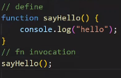

- If parameter is defined in the function definition but not passed while invokation, it will be considered         `undefined`
- There is no need to define the "type" of parameter in javascript and the function has no fixed return type.

- Functions are treated as a variable and can be re-assigned to another variable, if needed. 

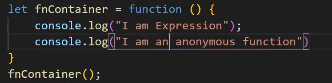

- When let and const did not exist, var used to show unstable behaviour in some situations

- IIFE - Immediately Invoked Function Expression
    - It is invoked on its own as soon as the script is executed

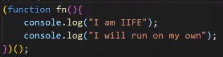

- Arrow function - A way of defining functions that shortens the syntax. Used very often in React in concepts of `bind` and `this`
Syntax:
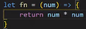
Shorthand for single parameter:
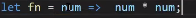

- Variable can be passed as a parameter, so a function, since it can be assigned, can be passed as a parameter in another function
    - When a function is passed as a parameter, its address is passed in the parameter
    - Example 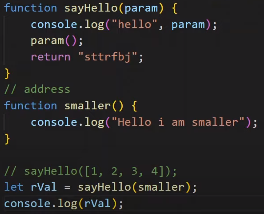
    - Output: 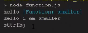

- We can return a function as well
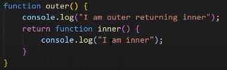
    - The returned value will be the address of the function,and can be stored in a variable, which in turn can be called.

</details>

---


<details>
<summary>

> # JS Code Execution | Hoisting | Execution Context
</summary>

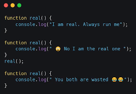

Output: 


Reason:

Function `real` is allocated in the heap memory and its reference (address) is passed in the stack. 

The second time `real` is declared, it will be created once more in the heap, at a different address. The reference in the stack will change, and will point to the new address.

A new function will be created in the heap for the third declaration, and the stack will point to it now.

No matter where you call the function in the program, the latest `real` will be called as it was referenced in the stack before the code was executed


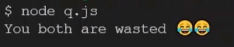    

_________


- JS code executes top to bottom, left to right

- Execution Context is a wrapper for our JS code which contains the following:
    1. Global object
        -  `console.log(global)` will print the global object in Node.js
        - It till print `window` object in the browser


    2. this
        - Whenever an execution context is created, so is `this`
        -   `console.log(this)` will return an empty object in Node.js and will return the `window` object in the browser


- Any piece of code that is not inside the function is global in nature
    - The wrapper for this code is known as global execution context


- Whenever execution context is created (creation phase) before the code is executed, we receive the following:
    1. Global object
    2. this
    3. the code itself is allocated memory


___


## Memory allocation
`var` : Memory is allocated, assigned `undefined` value. This mempry allocation process is known as "`hoisting`" 

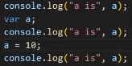

Output: 

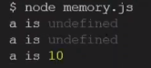


`functions` : Memory is allocated to the functions before the execution of the code. Functions are made in the heap and the reference in put in the stack.

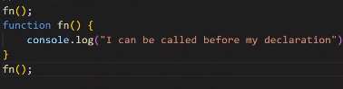

Output:

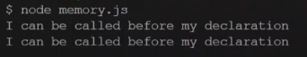


Q:

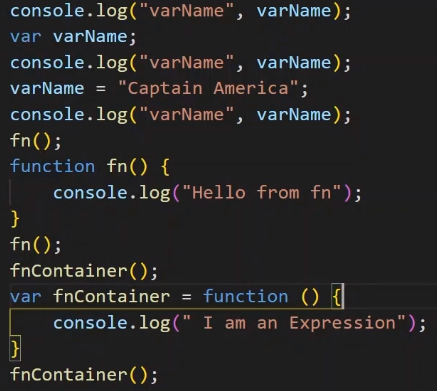

Output:

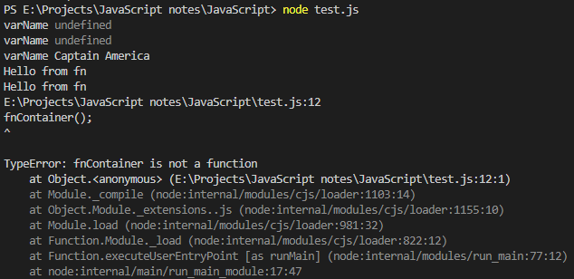

Reason: `var` has undefined value by default

</details> 

___

<details> 
<summary>

> # Lexical scope and scope chain
</summary>

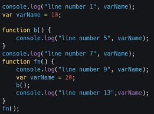

Output:


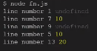


Reason: Lexically, searching "outside" means outside the definition of the function, not where it is called.

Note: After a function is done executing, it is removed from the call stack.

___

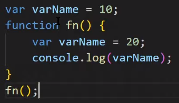

Output:

`20`

Reason:

Our code runs in the execution context, which is inside the call stack.

Our code runs inside the global execution context, which has the global object, this, and the code (i.e. the variables, functions etc. are alloted memory)

`varName` is set as undefined, and the function in in the made in heap memory, with the address reference in the call stack.

Whenever a `function is called`, its own execution context is created on the stack. 
The global object is passed on to this new context, and `this` is calculated. The variables inside the function are allocated memory, so a new `varName` is created, with value set as undefined. Then, the code is executed.


Q:

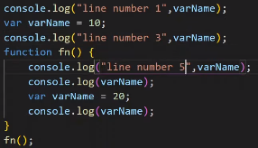

Output:

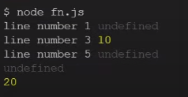

Reason: Line 5 is undefined because of the function's EC, which has allocated memory to a new `varName`

If we add the following block on code, it will pick up he value as 20 in line 8

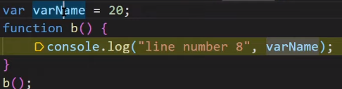

This is due to the scope, which is the area where a function or a variable can be found.

So, if function `b()` does not have `varName`, it will search outside the function body, layer by layer, all the way till the global area, till the variable is found. This is called `scope chain` If not found, it will give an error.
</details> 

___

<details> 
<summary>

> #  Questions on var keyword & function scope
</summary>
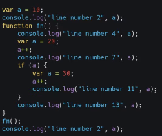

Output:

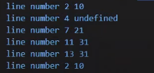

___

`var`'s value can be re-assigned. 

Re-declaration is of no use as the variable has already been allotted memory

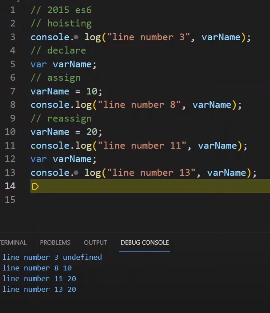

___
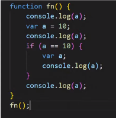

Output:

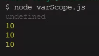

Reason:
`var` follows functional scope, so once a variable is declared inside a function, re-declaration will not have any effect, though the value can be re-assigned

___
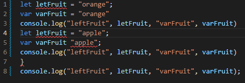

Output:

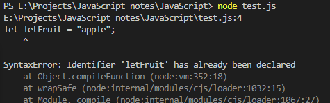

</details> 

---
<details>
<summary>

> # Let, Const
</summary>

`let` and `const` were introduced in ES6

`let` : Declaration is the same as var, and the default value is undefined

The value can be re-assigned, but a variable cannot be re-declared in this case. Here, it will give an error while hoisting/interpreting, so code for valid lines will not be executed at all.

Temporal dead zone: An area for let and const between the line where code starts and the line in which the variable is declared.

This means that we cannot access a variable before it is declared in let and const, whereas in var it gave the value as undefined.

TDZ is not an error, but a safety measure.

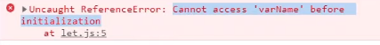


`const` : Similar behavior as let wrt TDZ, but we have to assign the variable some value. 

We cannot re-assign the value of this variable nor can we re-declare it.

___

Block scope : Memory of a variable is allotted according to the block

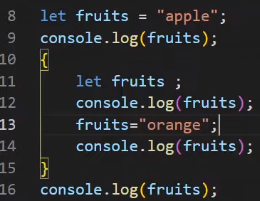

Output:

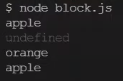


Temporal dead zone is also valid inside the block
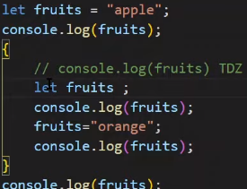

If the same variable is not defined inside the block, then it will look for it in outer blocks

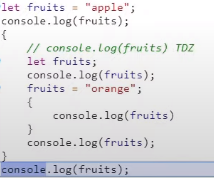

Line 28 will print "orange"

___

Variable shadowing: A variable defined within an inner block shadows a variable of the same name defined in the outer block.

Illegal shadowing: var is function scoped, let and const are block scoped. Therefore, if `var` is defined in the inner block and a variable of the same name but with `let` or `const` is defined in the outer block, it is considered illegal and will give an error.

___

Summary:

`var`
- Scope: function
- Reassign: Allowed
- Redeclaration: Allowed
- Temporal dead zone: N/A

`let`
- Scope: block
- Reassign: Allowed
- Redeclaration: Not allowed
- Temporal dead zone: Yes

`const`
- Scope: block
- Reassign: Not allowed
- Redeclaration: Not allowed
- Temporal dead zone: Yes

___

Note:

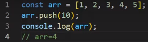

Line 2 is a valid operation, Line 4 is not

When we define an array using const, the reference of the first element is stored in the variable, it should not be removable but an operation like `arr.shift()`, which removes the first value of the array, is valid. 
</details> 


---

<details>
<summary>

> # Everything is an object in JS

</summary>
An object consists of key value pair

The key can be string or a number
```
 let object = {
    name: "Arindam",
    lastName: "Keswani",
    sayHi: function () {
        console.log("Arindam says hi!")
    }
}
```

To loop over the object's keys and retrieve values:

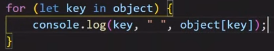

Everything, including an array is an object in JS

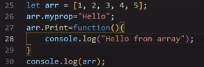

Output:

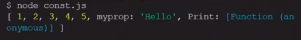

If you try to run a for-in loop on this array like before, you will see the following:

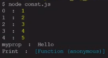

Each "index" acts as a key. Defining a random index say `arr[90]=100` will give empty values in between.

Objects are emulated as arrays in JS

Therefore, to answer the question give at the end of the previous section.

When `.shift()` operation is performed, the "0" key is removed, but the reference remains the same.

___

We can assign properties to functions as well, which will treat the function like an object.

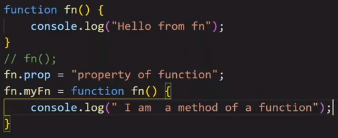

On printing the function, we will get:

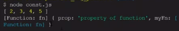

So, function is an object, and has a key:value pair functionality

Extra feature: Code inside a function can be executed when you invoke the function.

Everything including Dates, erroes, modules are objects

Though, there are 6 primitive types -> number, string, boolean, undefined, null, symbol
</details>

___

<details>
<summary>

> # Pure functions

</summary>


Earlier, we have procedural programming, and OOPS, not functional programming is very common

Procedural: Go through the code line by line. We explain how to do a task.

OOPS: Break down the problem into objects and classes with concepts on inheritance, polymorphism, etc.

Functional programming:
There are two ways of writing code, imperative and declarative. 
Functional programming follows the latter.

It always focuses on immutability.

___

Imperative v/s Declarative

Imperative: Focuses on how to go about a problem

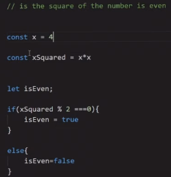

Declarative: Give me the problem, I will return the solution

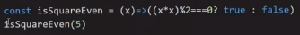

___

Pure and Impure functions

Impure functions: Same function can give different return value even if the params passed to it are the same

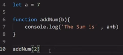

Value of the function will change if `a` changes in value. So, a fnuction should not depend on an external factor

Pure functions: 

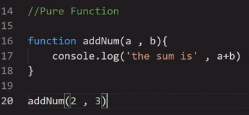

It will always return the same results for the same set of arguments passed to it.
Other than the result of the function, no external state should be changed, therefore `console.log()` changes the external screen and is a side effect.

So, the purest way to write it would be


___

Mutability and Immutability

Functional programming recommends immutable code so that the values that we have assigned cannot be altered

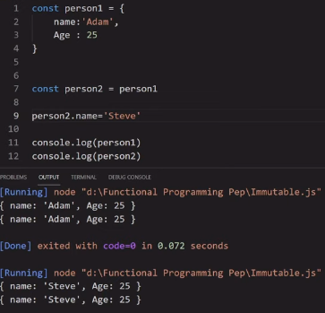

Data was mutated, even when we did not wish to. 

Solution:

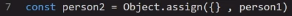

Or, use Spread operator

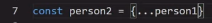

Keep nesting in mind
</details>

---

<details>
<summary>

> # Higher order functions (map, filter, reduce)

</summary>

Higher order functions take another function as a parameter to which we pass some data to get some desired output.

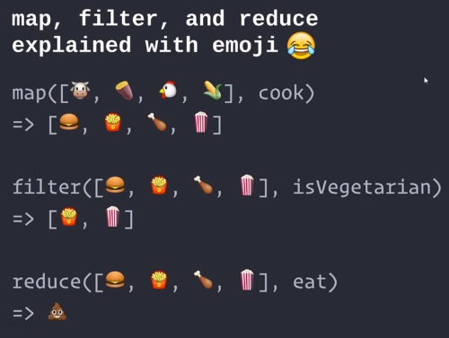

`map` : Iterates over the entire array, takes each element as the parameter in the inner function and returns its updated value in a new array.

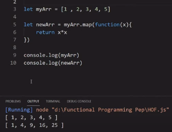

`filter` : Returns a new array, after iterating over the elements of the previous array and selecting those elements that fulfil a given condition. Whenever the condition is true, the value is selected, otherwise it is not.


`reduce` : Takes the value calculated so far (accumulated value), and the current element and returns a single accumulated value

Make sure that you initialize the accumulator (as done in line 25)


</details>

---

<details>

<summary>

> # Polyfills of map , filter & reduce

</summary>

Older browsers do not support some ES6 functions, so we need to write imperative code for those functions, which are known as polyfills

`map` 

Declarative code:


Imperative/polyfill code:


`filter`

Declarative code:


Imperative/polyfill code:


`reduce`

Imperative/polyfill code:


Polyfills using `this` and `Array.prototype` can be found [here](https://reeversedev.com/polyfill-for-foreach-map-filter-reduce)

</details>

---

<details>
<summary>

> # Closures in JavaScript

</summary>

## <u> Function scope </u>


If we run the above code anippet, we will get the following error


This is because we cannot access a variable defined inside a function from outside that function, irrespective of its initialization being done using `let`, `var`, or `const`.


## <u> Lexical scope </u>


Output: 
`9`

Reason: The variable `a` can be accessed from inside the function. A nested/child function can access its parent's variables.


## <u> Closures </u>

When a function returns something, its execution is over and it is removed from the stack.

Say we return a function from another function in the following manner


The inner function (addChild) will be stored in `catchAdd`. So now we can call it and the output will be `9` again, even though the child function is being called from outside the parent function.

This shows that the child function still has access to the parent function although the parent function has been removed from the stack. This is known as closures.

A function is always bundled with its lexical scope i.e. a function always has access to its lexical scope, even if the parent function does not exist on the call stack anymore


</details>

---

<details>
<summary>

> # Prototype and Polyfills of Map, Filter, & Reduce

</summary>
JS engines work behind the scenes in a browser to run JS code

Every browser has a different engine.

Chrome: V8 Engine (also used by Node.js)
Mozila Firefox: Spider Monkey
Internet Explorer: Chakra

When you define an array in the browser's console in the following manner, you will get a part of the output that says `[[Prototype]]`


On clicking the drop down menu we will see a list of functions. These are all the functions that we can use on a JS array. But it is not necessary that each browser supports all these functions. This means that if we wrote our code by using functions that are available in one browser and not available in another, it will cause errors in the latter browser.

We can use this Prototype to create our own functions which we can use in any browser. 


Output: The array itself

So, we can implement map filter and reduce in this manner

___

`map`


`filter`


</details>

---

<details>
<summary>

> # Introduction to OOPS in JavaScript

</summary>

Concepts to study:
1. this
    - Behaviour in browser
    - Behavior in Node
    - Strict, non-strict mode in both browser and Node 

2. Contructor functions
    - Create your own objects

3. Call, Apply, Bind
    - With Bind polyfill (using Prototype)

4. Prototypal inheritance
    - Passing the behavior of an object to another object, not similar to classic inheritance concept

</details>

---

<details> 

<summary>

> # this

</summary>

`this` keyword behaves differently in different environments

The environments mentioned here are:
1. Browser
2. Node.js

In them there are 2 modes in which run execute JS code:
1. Non-Strict mode
2. Strict mode

E.g.: the following code will run without problems


But if we use strict mode, it will give an error


Output:


To fix this, initialise the variable with var, let, or const


## <u> Node.js and non-strict mode </u>

4 cases:

1. ### Logging `this`


An empty object is returned

___

2. ### Logging `this` inside a function


Output: Returns the global object


___

3. ### Logging `this` inside a function in an object


Output: Returns the object in which it is defined


___

4. ### Logging `this` inside a nested function in an object


Output: Returns the global object
___

## <u> Node.js and strict mode </u>

4 cases:

1. ### Logging `this`

Output: Returns an empty object `{}`

___


2. ### Logging `this` inside a function


___


3. ### Logging `this` inside a function in an object

Output: Returns the object in which it is defined

___


4. ### Logging `this` inside a nested function in an object

Output: `undefined`

___


## <u> Browser and non-strict mode </u>


4 cases:

1. ### Logging `this`

Output: Returns `Window` object


___


2. ### Logging `this` inside a function

Output: Returns `Window` object

___


3. ### Logging `this` inside a function in an object

Output: Returns the object itself

___


4. ### Logging `this` inside a nested function in an object

Output: Returns `Window` object

___

## <u> Browser and strict mode </u>

4 cases:

1. ### Logging `this`

Output: Returns `Window` object

___


2. ### Logging `this` inside a function

Output: `undefined`

___


3. ### Logging `this` inside a function in an object

Output: The object itself is returned

___


4. ### Logging `this` inside a nested function in an object

Output: `undefined` 

</details>

---

<details>

<summary>

> # Call, Apply, Bind

</summary>

In the previous section, we saw how `this` can be used in different situations, and the output depends on the context.

There are some functions that use `this` to perform some operations, namely call, apply, and bind functions


Output:  

As `this` inside a function inside an object refers to the object itself


## `call`

Now, to do the same for `person2`, we need a better way to use the same function without making the same function inside the object, by re-using what is already created in `person1`, using `call` method


Output: 


This is known as "function borrowing"

Let's say that we do not wish to give an object enough importance that every other object is borrowing functions from it. 

So, we can define this function globally


So, not we do not need to borrow the function from `person1` object


If we want to add parameters in this function, we can do so as follows:


___


## `apply`

Syntax (using the previous exmaple) :


Here, the argument is passed in as apart of an array

___

## `bind`


If we try to run the code in the same way as the call function, the output will be blank because the bind function did not actually make the call.

The `bind()` method creates a new function that, when called, has its `this` keyword set to the provided value.

Calling this function would get the desired value from the object it is bound to.


Output:


</details>

---


<details>

<summary>

> # Function currying

</summary>

Currying is helpful when you have to frequently call a function with a fixed argument.


Output for both:

`7`

### Currying using closures


The inner function is returned, and then it is called with a parameter (3). This returned function will have access of variable `x` because of closure property.

Here `x`=2 and `y`=3, So output will be `5`

</details>

---

<details>
<summary>

> # Bind polyfill

</summary>

Like we used Array prototype to implement polyfill of map, filter, reduce, we can use Function prototype to write the polyfill of bind.

Default usage of bind is as follows:


First step is to understand that `bind` returns a function

`this` points towards the function on which bind is applied


Next, we need to attach the object to which we want to bind the function.

The object is passed in the first argument.


Our bind function is able to refer to our object, but this will not handle the case of multiple parameters


To use these parameters, extract them by using `slice` but keep in mind that params will have an array.


Simple use apply instead of call to have the returned function accept the parameters as an array


Even after this, currying will cause problems and we will not be able to dynamically send parameters. 

For that, handle args in the returned function


</details>

--- 

<details>

<summary>

> # Constructor functions

</summary>

Let's say that we are expected to create objects which contain some details related to cars, so one way of doing that is as follows:


But this is a tedious way to do the task. 

A better way is to define a function with the details as the arguments, which returns the new object with the required properties

Constructor Functions can be used for such a job.


When `this` is defined inside a function, it returns the global object, but when constructor functions are defined and used with the `new` keyword, `this` returns an empty object.

Basically, it returns a new object in which we can define our properties.

We can then use `this` keyword to create properties and assign them values using the parameters that we have passed


Output:


You can create any number of such objects as follows:


You can access and mutate the object using dot `.` operator:


Adding a function insode the function can be done as follows:


Call the function:


Output: 

</details>


---

<details>

<summary>

> # Prototype and Prototypal Inheritence

</summary>

### What are prototypes?

We have a lot of in-built functions for data structures such as arrays (map, filter, reduce, etc), and properties too (e.g. length) that we can access. Same goes for other data structures such as objects


`arr.__proto__` will return a list of functions that the array can use

Prototype can be understood to be an object that maintains the list of in-built functions of the respective data structure

It is the same as `Array.prototype`


The following returns properties related to an object that we can access:


The returned value in an object. Since the prototype of the prototype of the array represents the properties of an object, it can be implied that the array is actually an object in JS

Further proof of that:


Suppose we define an object as follows let's check out its prototype:


These are the properties that are available to an object

If we try to get its prototype even further, it will return `null`


___

### What is prototypal inheritance?

Imagine an object such as the one below:


Output: `Adam 25`

Create another object as follows:


Now, we will try to manipulate the prototype of `perosn2`


Output: `Steve` (which was the original name of `person2`, so the `name` property was overriden by `person2`)

But if we print the age (which is originally not present) as well:


Output: `Steve 25`

The output will be the same if we try to call 

This is prototypal inheritance

</details>

---

<details>
<summary>

> # Creating Objects with Classes and Constructors

</summary>

JavaScript does not have in-built concept off classes. It is simply syntactical sugar.

To create an object using class, first define the class


`person1` will store an object as follows:


In this manner, we can create an object using a class and a constructor

To define a function in a class:


Output:   because `this` inside a function that is inside an object points to the object itself

We can use classical inheritance as well.


Output: `Steve`

We have inherited the `showDetails()` function.

It is not recommended to use inheritance in JS.

</details>

---

<details>

<summary>

> # Sync and Async programming with callbacks ft. event loop

</summary>

### Callbacks

Stopping the main thread for a long process is inefficient as the rest of the processes get halted

So we can tell these processes "I will resolve your process, but later. I will call you back.". Then we continue to solve processes in the thread and deal with this longer process later.

This is the concept of <u>Asyncronous JavaScript</u>

JavaScript is a synchronous, single-threaded language. Since this synchronous behavior can make the code run slowly, the concepts of callbacks, promises, async await were introduced.


Say we have the following function:


We want to move to `log` functionality to another function, as follows. 


We passed a function `logGreeting()` as a callback function to `greet()` as a parameter, and got the same output.

We can pass multiple functions as follows:


Output:

 

The callbacks that we just encountered are known as synchronous callbacks, as the code executed line by line without interruptions.

Asynchronous callbacks can be understood as follows:


Output:
```
Hello
bye
*1 second delay*
I am st2
*1 more second delay*
I am st1
```

Initially, one would expect the output to be:

```
Hello
*2 second delay*
I am st1
*1 second delay*
I am st2
bye
```

The reason for the actual output can be understood by visualising the call stack, Node APIs, callback queue, and the <u>event loop</u>:

As soon as JS code is executed, the global execution context (GEC) in created in the call stack, which means that the main thread of processes goes to the call stack


Then line 1 will be executed and put on the call stack


Then `Hello` is logged and the process is removed from the call stack


Then we encounter `st1`.

Note: setTimeout() is not an in-built JS function. It is provided by Node.js

So it goes straight into the Node API


Then, `st2` is encountered and dealth with in the same way


After the two callbacks functions are done executing and their output is ready, the callback queue picks them up in FIFO order, So `st2` will be giving preference as its output was ready in 1 sec while `st1` took 2 secs


Then the event loop checks the call stack to see if it is empty, and in this case it is not as we have `sayBye` yet to be called


After getting called, and its output logged, it is removed from the call stack


Output so far:


Then the main thread is done executing and the call stack is now empty

So the event loop now gives permission to `st2` to the call stack


Then after executing its output, it will remove `st2` and bring `st1` to the call stack and log its output


With that, the execution will be completed

</details>

---

<details>

<summary>

> # Serial and Parallel execution of Code with callbacks ft. Event Loop

</summary>

As discussed in the previous section, the code flow can be sync or async

Similarly, tasks can be serial or parallel.

## Serial tasks:

E.g. We are supposed to upload a video, so the steps to do that will be the following:

1. Create the video
2. Edit the video
3. Upload the video

Each step is dependent on the previous one, and cannot process till the prev step is completed.

## Parallel tasks:

E.g. Downloading videos from a website. The order in which the videos are downloaded does not matter

These tasks are independent of each other.

___

We have the following snippet:


Note: Typo - `fs.readFile`

Output: 

The Buffer portion of the output contains the data of the file, which can be printed as it is if we apppend a string to it.

Notice how the content is printed after the `after` line. 
The async nature is responsible for this.


Line 4 will be executed first, the process will be brought on to the call stack, then removed after the logging `before` is complete.


Note that `fs.readFile` is not a JS function, it is provided by Node, so it will go in the Node API section along with the callback function


Then line 18 will be executed, brought on to the call stack, `after` is logged, then process is removed from the call stack

Output so far:


After that, the callback function comes in the callback queue after its output is ready.

The event loop will check if the call stack is empty, and then push the callback function on it for its output to be executed

___

So how do we read files serially and parallely?

## Parallel:


Output:


Notice how the output is not displayed in the order in which it is encountered in the code. 

This is due to parallel reading of files in the Node API section. Whichever file is done executing first, is pushed to the callback queue first, which implies that it is brought to the call stack first, where the output is then printed.
 
If you run the code again, you may receive the file content in a different order

## Serial:

We need to make sure that the callback functions are called in the sequence in which we require them to.

We will have to use nesting for that.


Output:


The output will be the same no matter how many times we run it.

These nesting of callbacks is popularly known as "callback hell".

</details>

---

<details>

<summary>

> # SetTimeout and SetInterval Ft. setInterval Polyfill

</summary>

As discussed before, setTimeout and setInterval are not JS functions. They are provided by the environment in which we run our code, i.e. Node.js or the browser

## setTimeout

It is a function that takes a function as a callback and executes it after a certain specified period of time

Usage:


This will print `Hello` after 5 seconds


Output:
```
Byeeee
*5 second delay*
Hello
```
This is because Line 9 is executed as part of the main thread and setTimeout has been pushed to the Node API

After setTimeout is done executing, it will be brought to the callback queue, and from there it will be brought to the call stack as soon as the latter is empty (the main thread has completed its work) [this is verified by the event loop], after which the output is setTimeout is logged.

## setInterval

Works similar to setTimeout, but unlike setTimeout, which executes the code in it only once, setInterval will continue to repeatedly execute that block of code after the specified interval.

Usage:


Output:

`Hiiii` will repeatedly print after every 2 seconds

This process will happen infinitely, unless stopped.

To stop it, we can use `clearInterval`

Note: Every function such as setInterval has an ID assigned to it, so we need to catch the setInterval function inside a variable and pass the variable to the clearInterval() function as follows:


Output:
```
*2 second delay*
Hiii
*2 second delay*
Hiii
*2 second delay*
Hiii
```
___

## setInterval Polyfill

We need to create our own setInterval and clearInterval

The skeleton will be as follows:


In this function, we will define the functions required to implement the requirements

setInterval logic:


clearInterval logic:


To test the code, call the created functions:


The callback passed should be `greeting`, not `greet`.

</details>

---

<details>

<summary>

> # Promises Polyfill

</summary>

A few things to note:

Promise has 3 states:
1. Pending
2. Fulfilled
3. Rejected

Promise is not a function, it is an object.
After running a function, the Promise is visible after the output is returned.

Based on the output, the Promise returns one of the three above states.

We will be creating a Promise using a constructor function

Default states are as follows:


Now, we need to write `.then()` and `.catch()` functions


else condition signifies that we are yet to handle that callback, so we push it in the respective array, from where it will be sequentially handled.

Next, we will pass the resolve and reject functions in the executor


Create new Promises


`doWork` is actually the executor which is to be resolved

This will then run the `resolve` function and updates the values accordingly

Otherwise, it will be rejected and the respective function will be called

Make a new Promise


Output:


After changing the conditions to run the catch block, we get


</details>

---

<details>

<summary>

> # Micro Task Queue

</summary>


Output:


Note that "I am Set Time Out" is printed after a delay.

Explanation: 

1. GEC is created and put on the call stack
2. Line 1 is executed and process is put on the call stack
3. "Program Starts" is printed, removed from the call stack
4. SetTimeout block brought onto the call stack and is then pushed to the Node APIs for execution
5. Promise block is also pushed to the call stack, then to the Node APIs section, as it is not a JS functionality
6. Line 13 is executed, as the others are Node APIs. It is brought onto the call stack
7. "Program Ends" is printed and removed from the call stack
8. Similar to callback queue, we also have a micro task queue. Its job is to take in Promisified code's output.
9. setTimeout's output will be taken to the callback queue
10. Now that the main thread is done executing, the event loop can look at the queues for any output's that need to be dealt with
11. Microtask queue is given priority over callback queue, hence, the Promisified code is pushed to the call stack first, which is why we see Promise's output first.
12. Output for setTimeout is then printed in the end

</details>

---

<details>
<summary>

> # Promises and associated functions

</summary>

## .all()


Output:


Pass all promises as an array in this function, and get a promise in return.
By using .then(), we can get an array containing the results of the Promises as soon as they are resolved


Output:


In case a Promise is rejected (and a catch statement is added to catch the error)


 


Output:


Promise.all() wants all Promises to be resolved, otherwise it will go in the catch block and will not resolve any Promises even if one Promise is rejected

___

## .race()

[Referring to the original code, where all 3 promises were resolved]

This works in a similar way as .all() as we pass an array of promises here as well.
It returns a single value, which is the value of the first Promise that gets resolved. It does not wait for all Promises to get resolved.


Output:


In case of rejections:


Output:


Another case:


Output:


Reason: Race function returns the value of the first resolved Promise

___

## .allSettled()

After all Promises are settled (), returns the details of each in an object 


Output:


This function returns an object with a key "status" indicating the status of the Promise, and its "value".

In case of rejections,


Output:


___

## .finally()


`finally` block runs irrespective of the promise being resolved or rejected, i.e. whether we go in the `then` or `catch` block, the code inside the `finally` block will always run. This is usually used as a clean-up mechanism.

In the following scenario:


The output will be:


After adding a `finally` block as shown: 

Note: Line 2 : `var a=1+3`


Output:


## resolve()

Function that is used by a Promise to get resolved

It returns the resolved Promise and its value can be acquired using `.then()`


Output:


## reject()

`reject()` works in a similar way as `resolve()`, but instead of resolving the process it rejects it.

It is used with `catch` instead of `then`.


Output:


</details>

---

<details>

<summary>

> # Read Limited Files with Promises (Serial and Parallel)

</summary>

Earlier, using callbacks, we read files serially (using nesting) and in-parallel (reading them normally). 
We used `fs.readFile()` for that.

Using promises, we can achieve the same using `fs.promises.readFile`. This returns a Promise and upon its fulfilment, from where we can retrieve its value.


Output:


___

Use `.then()` to get the value of the file


Output:


To view the actual data, concatenate the data with a string


Output:


Run it again, and the order of output will change


This is how files are read in-parallel using Promises

Note: The concept of event loop and microtask queue applies here as well.

___

To read the files serially, we use chaining:


Output:


</details>

---

<details>

<summary>

> # Read 'n' files using Promises (Serial and Parallel)

</summary>

It is not practical to read a large number of files using chaining, so we loop over the files:

To read files in-parallel:


Output:


Note: All readFile operations will be performed in the Node API section, not the call stack. After the output is ready, it will be pushed to the microtask queue, and the event loop will push it on the call stack when possible.

To do the same task serially:


Output:


Data of all files except `f4.txt` is printed

To fix that, we will catch the data given by its Promise separately


Output:


</details>

---

<details>


<summary>

> # Promises over callbacks

</summary>

Apart from issues like "callback hell", callbacks are not trustworthy overall.

Suppose we have the following function:


It is imported in another file:


Output:


If we change the `updateAccount` code to the following:


Output:


So if a developer calls the callback more than once by mistake, the customer will be charged  multiple times for the same product.

We will use Promises to rectify this. We modify the previous code accordingly.


The function is called as follows:


</details>

---

<details>

<summary>

> # null Vs undefined Vs not defined

</summary>

## undefined

We have come across a similar code snippet before, while studying var, let, const, and hoisting:


Output: `undefined`

Reason: variable `a` is assigned memory, but its value is not initialized yet.

## not defined

But if we try to print the variable without assigning memory to it, it will be considered `not defined`


So, `undefined` means that we have the variable in our memory, but we do not have its value
`not defined` means that we do not have the variable in our memory

## null

In the following snippet:


If we try to run it, the output will be `null`, but if we remove the code in line 6, it will not give `undefined` as the output.

So, we had to assign the `null` value <b>explicitly</b>, unlike undefined.

___

Similarly, the following snippet will also return `undefined`:


But we know that the global object does exist. What if we tried to access a variable from an object that does not exist?


Output:


But if we make the object, and from it we try to access a non-existent variable:


Output: `undefined`

---

`undefined`: Value given by JS Engine when the variable is in the memory but they do not have an assigned value. This can also be explicitly defined.

`null`: Value given explicitly by us to some variables that exist, but we don't have their value.

`not defined`: Variable does not exist in memory at all.

___

More use cases:

In an object, if we have kept a key, we have to assign some value to it, otherwise it will throw an error


So, if one does not have a middle name, we can set it as `null` instead.


Output: `null`

If we try to access a key from the object that does not exist:


Output: `undefined`


</details>

---

