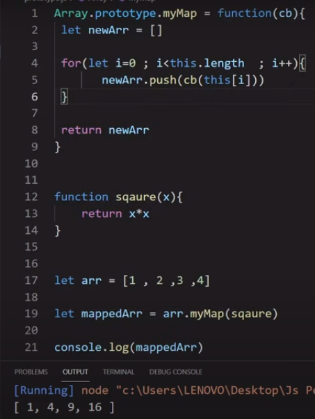
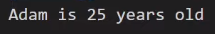

# JavaScript Notes

<details>
<summary>  

> # What is JavaScript? 
</summary>
- Language that provides logic inside the JavaScript Runtime environment, which is present in browsers, like V8 Engine in Chrome, Firefox's SpiderMonkey, etc.
- Features/APIs are given by the Environment itself. E.g.
    - the line `console.log()` is not a part of JavaScript. It is a feature given the the env such as a browser or Node.js
    -  `setTimeout` is also considered to be a part of JS but is given by the browser. 
    - Various other tasks such as queueing, threading, etc. are taken care of by the environment. They are not a part of JS
- It is syntactically similar to Java, OOPS concepts were taken from Self, functional programming (where functions can behave as variables)
- ECMA Intl. laid out the standards based on which JS is supposed to behave, so JS is an implementation of the ECMAScript standard
    - ECMAScript is written by representative of the browsers who mutually decide the features of the script

- Node.js is an environment that supports JS
- Changing the UI is a very costly operation, so we wish to optimise it as much as possible, which is where frameworks/libraries such as Angular, Vue, React come in. They implement the optimisation of changing of UI components.

</details>

---

<details>
<summary>

> # Types of functions in JavaScript
</summary>

- Functions are very powerful in JavaScript and can be used in many ways, so much so that they are considered first-class citizens.


- If parameter is defined in the function definition but not passed while invokation, it will be considered         `undefined`
- There is no need to define the "type" of parameter in javascript and the function has no fixed return type.

- Functions are treated as a variable and can be re-assigned to another variable, if needed. 


- When let and const did not exist, var used to show unstable behaviour in some situations

- IIFE - Immediately Invoked Function Expression
    - It is invoked on its own as soon as the script is executed


- Arrow function - A way of defining functions that shortens the syntax. Used very often in React in concepts of `bind` and `this`
Syntax:

Shorthand for single parameter:


- Variable can be passed as a parameter, so a function, since it can be assigned, can be passed as a parameter in another function
    - When a function is passed as a parameter, its address is passed in the parameter
    - Example 
    - Output: 

- We can return a function as well

    - The returned value will be the address of the function,and can be stored in a variable, which in turn can be called.

</details>

---


<details>
<summary>

> # JS Code Execution | Hoisting | Execution Context
</summary>


Output: 


Reason:

Function `real` is allocated in the heap memory and its reference (address) is passed in the stack. 

The second time `real` is declared, it will be created once more in the heap, at a different address. The reference in the stack will change, and will point to the new address.

A new function will be created in the heap for the third declaration, and the stack will point to it now.

No matter where you call the function in the program, the latest `real` will be called as it was referenced in the stack before the code was executed


    

_________


- JS code executes top to bottom, left to right

- Execution Context is a wrapper for our JS code which contains the following:
    1. Global object
        -  `console.log(global)` will print the global object in Node.js
        - It till print `window` object in the browser


    2. this
        - Whenever an execution context is created, so is `this`
        -   `console.log(this)` will return an empty object in Node.js and will return the `window` object in the browser


- Any piece of code that is not inside the function is global in nature
    - The wrapper for this code is known as global execution context


- Whenever execution context is created (creation phase) before the code is executed, we receive the following:
    1. Global object
    2. this
    3. the code itself is allocated memory


___


## Memory allocation
`var` : Memory is allocated, assigned `undefined` value. This mempry allocation process is known as "`hoisting`" 


Output: 


`functions` : Memory is allocated to the functions before the execution of the code. Functions are made in the heap and the reference in put in the stack.


Output:


Q:


Output:


Reason: `var` has undefined value by default

</details> 

___

<details> 
<summary>

> # Lexical scope and scope chain
</summary>


Output:


Reason: Lexically, searching "outside" means outside the definition of the function, not where it is called.

Note: After a function is done executing, it is removed from the call stack.

___


Output:

`20`

Reason:

Our code runs in the execution context, which is inside the call stack.

Our code runs inside the global execution context, which has the global object, this, and the code (i.e. the variables, functions etc. are alloted memory)

`varName` is set as undefined, and the function in in the made in heap memory, with the address reference in the call stack.

Whenever a `function is called`, its own execution context is created on the stack. 
The global object is passed on to this new context, and `this` is calculated. The variables inside the function are allocated memory, so a new `varName` is created, with value set as undefined. Then, the code is executed.


Q:


Output:


Reason: Line 5 is undefined because of the function's EC, which has allocated memory to a new `varName`

If we add the following block on code, it will pick up he value as 20 in line 8


This is due to the scope, which is the area where a function or a variable can be found.

So, if function `b()` does not have `varName`, it will search outside the function body, layer by layer, all the way till the global area, till the variable is found. This is called `scope chain` If not found, it will give an error.
</details> 

___

<details> 
<summary>

> #  Questions on var keyword & function scope
</summary>


Output:


___

`var`'s value can be re-assigned. 

Re-declaration is of no use as the variable has already been allotted memory


___


Output:


Reason:
`var` follows functional scope, so once a variable is declared inside a function, re-declaration will not have any effect, though the value can be re-assigned

___


Output:


</details> 

---
<details>
<summary>

> # Let, Const
</summary>

`let` and `const` were introduced in ES6

`let` : Declaration is the same as var, and the default value is undefined

The value can be re-assigned, but a variable cannot be re-declared in this case. Here, it will give an error while hoisting/interpreting, so code for valid lines will not be executed at all.

Temporal dead zone: An area for let and const between the line where code starts and the line in which the variable is declared.

This means that we cannot access a variable before it is declared in let and const, whereas in var it gave the value as undefined.

TDZ is not an error, but a safety measure.


`const` : Similar behavior as let wrt TDZ, but we have to assign the variable some value. 

We cannot re-assign the value of this variable nor can we re-declare it.

___

Block scope : Memory of a variable is allotted according to the block


Output:


Temporal dead zone is also valid inside the block


If the same variable is not defined inside the block, then it will look for it in outer blocks


Line 28 will print "orange"

___

Variable shadowing: A variable defined within an inner block shadows a variable of the same name defined in the outer block.

Illegal shadowing: var is function scoped, let and const are block scoped. Therefore, if `var` is defined in the inner block and a variable of the same name but with `let` or `const` is defined in the outer block, it is considered illegal and will give an error.

___

Summary:

`var`
- Scope: function
- Reassign: Allowed
- Redeclaration: Allowed
- Temporal dead zone: N/A

`let`
- Scope: block
- Reassign: Allowed
- Redeclaration: Not allowed
- Temporal dead zone: Yes

`const`
- Scope: block
- Reassign: Not allowed
- Redeclaration: Not allowed
- Temporal dead zone: Yes

___

Note:


Line 2 is a valid operation, Line 4 is not

When we define an array using const, the reference of the first element is stored in the variable, it should not be removable but an operation like `arr.shift()`, which removes the first value of the array, is valid. 
</details> 


---

<details>
<summary>

> # Everything is an object in JS

</summary>
An object consists of key value pair

The key can be string or a number
```
 let object = {
    name: "Arindam",
    lastName: "Keswani",
    sayHi: function () {
        console.log("Arindam says hi!")
    }
}
```

To loop over the object's keys and retrieve values:


Everything, including an array is an object in JS


Output:


If you try to run a for-in loop on this array like before, you will see the following:


Each "index" acts as a key. Defining a random index say `arr[90]=100` will give empty values in between.

Objects are emulated as arrays in JS

Therefore, to answer the question give at the end of the previous section.

When `.shift()` operation is performed, the "0" key is removed, but the reference remains the same.

___

We can assign properties to functions as well, which will treat the function like an object.


On printing the function, we will get:


So, function is an object, and has a key:value pair functionality

Extra feature: Code inside a function can be executed when you invoke the function.

Everything including Dates, erroes, modules are objects

Though, there are 6 primitive types -> number, string, boolean, undefined, null, symbol
</details>

___

<details>
<summary>

> # Pure functions

</summary>


Earlier, we have procedural programming, and OOPS, not functional programming is very common

Procedural: Go through the code line by line. We explain how to do a task.

OOPS: Break down the problem into objects and classes with concepts on inheritance, polymorphism, etc.

Functional programming:
There are two ways of writing code, imperative and declarative. 
Functional programming follows the latter.

It always focuses on immutability.

___

Imperative v/s Declarative

Imperative: Focuses on how to go about a problem


Declarative: Give me the problem, I will return the solution


___

Pure and Impure functions

Impure functions: Same function can give different return value even if the params passed to it are the same


Value of the function will change if `a` changes in value. So, a fnuction should not depend on an external factor

Pure functions: 


It will always return the same results for the same set of arguments passed to it.
Other than the result of the function, no external state should be changed, therefore `console.log()` changes the external screen and is a side effect.

So, the purest way to write it would be


___

Mutability and Immutability

Functional programming recommends immutable code so that the values that we have assigned cannot be altered


Data was mutated, even when we did not wish to. 

Solution:


Or, use Spread operator


Keep nesting in mind
</details>

---

<details>
<summary>

> # Higher order functions (map, filter, reduce)

</summary>

Higher order functions take another function as a parameter to which we pass some data to get some desired output.


`map` : Iterates over the entire array, takes each element as the parameter in the inner function and returns its updated value in a new array.


`filter` : Returns a new array, after iterating over the elements of the previous array and selecting those elements that fulfil a given condition. Whenever the condition is true, the value is selected, otherwise it is not.


`reduce` : Takes the value calculated so far (accumulated value), and the current element and returns a single accumulated value

Make sure that you initialize the accumulator (as done in line 25)


</details>

---

<details>

<summary>

> # Polyfills of map , filter & reduce

</summary>

Older browsers do not support some ES6 functions, so we need to write imperative code for those functions, which are known as polyfills

`map` 

Declarative code:


Imperative/polyfill code:


`filter`

Declarative code:


Imperative/polyfill code:


`reduce`

Imperative/polyfill code:


Polyfills using `this` and `Array.prototype` can be found [here](https://reeversedev.com/polyfill-for-foreach-map-filter-reduce)

</details>

---

<details>
<summary>

> # Closures in JavaScript

</summary>

## <u> Function scope </u>


If we run the above code anippet, we will get the following error


This is because we cannot access a variable defined inside a function from outside that function, irrespective of its initialization being done using `let`, `var`, or `const`.


## <u> Lexical scope </u>


Output: 
`9`

Reason: The variable `a` can be accessed from inside the function. A nested/child function can access its parent's variables.


## <u> Closures </u>

When a function returns something, its execution is over and it is removed from the stack.

Say we return a function from another function in the following manner


The inner function (addChild) will be stored in `catchAdd`. So now we can call it and the output will be `9` again, even though the child function is being called from outside the parent function.

This shows that the child function still has access to the parent function although the parent function has been removed from the stack. This is known as closures.

A function is always bundled with its lexical scope i.e. a function always has access to its lexical scope, even if the parent function does not exist on the call stack anymore


</details>

---

<details>
<summary>

> # Prototype and Polyfills of Map, Filter, & Reduce

</summary>
JS engines work behind the scenes in a browser to run JS code

Every browser has a different engine.

Chrome: V8 Engine (also used by Node.js)
Mozila Firefox: Spider Monkey
Internet Explorer: Chakra

When you define an array in the browser's console in the following manner, you will get a part of the output that says `[[Prototype]]`


On clicking the drop down menu we will see a list of functions. These are all the functions that we can use on a JS array. But it is not necessary that each browser supports all these functions. This means that if we wrote our code by using functions that are available in one browser and not available in another, it will cause errors in the latter browser.

We can use this Prototype to create our own functions which we can use in any browser. 


Output: The array itself

So, we can implement map filter and reduce in this manner

___

`map`





`filter`


</details>

---

<details>
<summary>

> # Introduction to OOPS in JavaScript

</summary>

Concepts to study:
1. this
    - Behaviour in browser
    - Behavior in Node
    - Strict, non-strict mode in both browser and Node 

2. Contructor functions
    - Create your own objects

3. Call, Apply, Bind
    - With Bind polyfill (using Prototype)

4. Prototypal inheritance
    - Passing the behavior of an object to another object, not similar to classic inheritance concept

</details>

---

<details> 

<summary>

> # this

</summary>

`this` keyword behaves differently in different environments

The environments mentioned here are:
1. Browser
2. Node.js

In them there are 2 modes in which run execute JS code:
1. Non-Strict mode
2. Strict mode

E.g.: the following code will run without problems


But if we use strict mode, it will give an error


Output:


To fix this, initialise the variable with var, let, or const


## <u> Node.js and non-strict mode </u>

4 cases:

1. ### Logging `this`


An empty object is returned

___

2. ### Logging `this` inside a function


Output: Returns the global object


___

3. ### Logging `this` inside a function in an object


Output: Returns the object in which it is defined


___

4. ### Logging `this` inside a nested function in an object


Output: Returns the global object
___

## <u> Node.js and strict mode </u>

4 cases:

1. ### Logging `this`

Output: Returns an empty object `{}`

___


2. ### Logging `this` inside a function


___


3. ### Logging `this` inside a function in an object

Output: Returns the object in which it is defined

___


4. ### Logging `this` inside a nested function in an object

Output: `undefined`

___


## <u> Browser and non-strict mode </u>


4 cases:

1. ### Logging `this`

Output: Returns `Window` object


___


2. ### Logging `this` inside a function

Output: Returns `Window` object

___


3. ### Logging `this` inside a function in an object

Output: Returns the object itself

___


4. ### Logging `this` inside a nested function in an object

Output: Returns `Window` object

___

## <u> Browser and strict mode </u>

4 cases:

1. ### Logging `this`

Output: Returns `Window` object

___


2. ### Logging `this` inside a function

Output: `undefined`

___


3. ### Logging `this` inside a function in an object

Output: The object itself is returned

___


4. ### Logging `this` inside a nested function in an object

Output: `undefined` 

</details>

---

<details>

<summary>

> # Call, Apply, Bind

</summary>

In the previous section, we saw how `this` can be used in different situations, and the output depends on the context.

There are some functions that use `this` to perform some operations, namely call, apply, and bind functions


Output:  

As `this` inside a function inside an object refers to the object itself


## `call`

Now, to do the same for `person2`, we need a better way to use the same function without making the same function inside the object, by re-using what is already created in `person1`, using `call` method


Output: 


This is known as "function borrowing"

Let's say that we do not wish to give an object enough importance that every other object is borrowing functions from it. 

So, we can define this function globally


So, not we do not need to borrow the function from `person1` object


If we want to add parameters in this function, we can do so as follows:


___


## `apply`

Syntax (using the previous exmaple) :


Here, the argument is passed in as apart of an array

___

## `bind`


If we try to run the code in the same way as the call function, the output will be blank because the bind function did not actually make the call.

The `bind()` method creates a new function that, when called, has its `this` keyword set to the provided value.

Calling this function would get the desired value from the object it is bound to.


Output:


</details>

---


<details>

<summary>

> # Function currying

</summary>

Currying is helpful when you have to frequently call a function with a fixed argument.


Output for both:

`7`

### Currying using closures


The inner function is returned, and then it is called with a parameter (3). This returned function will have access of variable `x` because of closure property.

Here `x`=2 and `y`=3, So output will be `5`

</details>

---

<details>
<summary>

> # Bind polyfill

</summary>

Like we used Array prototype to implement polyfill of map, filter, reduce, we can use Function prototype to write the polyfill of bind.

Default usage of bind is as follows:


First step is to understand that `bind` returns a function

`this` points towards the function on which bind is applied


Next, we need to attach the object to which we want to bind the function.

The object is passed in the first argument.


Our bind function is able to refer to our object, but this will not handle the case of multiple parameters


To use these parameters, extract them by using `slice` but keep in mind that params will have an array.


Simple use apply instead of call to have the returned function accept the parameters as an array


Even after this, currying will cause problems and we will not be able to dynamically send parameters. 

For that, handle args in the returned function


</details>

--- 

<details>

<summary>

> # Constructor functions

</summary>

Let's say that we are expected to create objects which contain some details related to cars, so one way of doing that is as follows:


But this is a tedious way to do the task. 

A better way is to define a function with the details as the arguments, which returns the new object with the required properties

Constructor Functions can be used for such a job.


When `this` is defined inside a function, it returns the global object, but when constructor functions are defined and used with the `new` keyword, `this` returns an empty object.

Basically, it returns a new object in which we can define our properties.

We can then use `this` keyword to create properties and assign them values using the parameters that we have passed


Output:


You can create any number of such objects as follows:


You can access and mutate the object using dot `.` operator:


Adding a function insode the function can be done as follows:


Call the function:


Output: 

</details>

